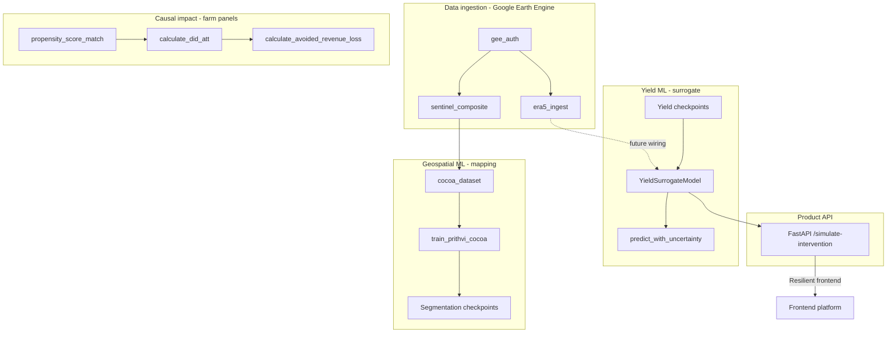

# resilient-cocoa-model

Geospatial machine learning and causal impact modeling for **resilient cocoa** in West Africa. This repository supports the [Resilient World](https://github.com/Resilient-World) platform by combining:

1. **Remote sensing** — Sentinel-1/2 composites, ERA5 climate, and Prithvi-based plantation mapping (TorchGeo / TerraTorch).
2. **Yield modeling** — A fast neural surrogate for process-based yield with Monte Carlo uncertainty.
3. **Causal impact** — Propensity score matching (PSM) and difference-in-differences (DiD) on farm panels.
4. **Product API** — FastAPI service so the Resilient frontend can **simulate interventions** and estimate avoided yield loss and financial impact.

**GitHub:** [Resilient-World/cocoa-model](https://github.com/Resilient-World/cocoa-model)

---

## Table of contents

- [Who this README is for](#who-this-readme-is-for)
- [System overview](#system-overview)
- [Repository layout](#repository-layout)
- [Technology stack](#technology-stack)
- [Getting started](#getting-started)
- [Configuration](#configuration)
- [Package reference](#package-reference)
  - [`src/data` — ingestion and datasets](#srcdata--ingestion-and-datasets)
  - [`src/models` — yield surrogate](#srcmodels--yield-surrogate)
  - [`src/training` — Prithvi fine-tuning](#srctraining--prithvi-fine-tuning)
  - [`src/analysis` — causal inference](#srcanalysis--causal-inference)
  - [`src/api` — intervention simulation service](#srcapi--intervention-simulation-service)
- [End-to-end workflows](#end-to-end-workflows)
- [Testing](#testing)
- [Data versioning (DVC)](#data-versioning-dvc)
- [Design decisions and limitations](#design-decisions-and-limitations)
- [Contributing](#contributing)

---

## Who this README is for

New engineers joining the cocoa modeling effort should use this document to understand:

- **What** each directory and module does.
- **How** the geospatial pipeline, yield model, causal analysis, and API relate (and where they are still decoupled).
- **Where** to run code, tests, and the HTTP service.

The project is developed as a **standalone Python package** (typically at `~/resilient-cocoa-model`), separate from other Resilient monorepos.

---

## System overview

The codebase implements **two complementary tracks** that will increasingly converge as real checkpoints and live geospatial feeds replace mocks.



| Track | Purpose | Primary outputs |
|-------|---------|-----------------|
| **Geospatial ML** | Map cocoa plantations (full-sun vs agroforestry) from Sentinel composites | GeoTIFF tiles, Prithvi segmentation weights |
| **Yield surrogate** | Fast yield prediction from daily climate + static site features | Tonnes/ha + epistemic uncertainty (MC dropout) |
| **Causal analysis** | Rigorous impact evaluation on observational farm panels | ATT (tonnes/ha), cohort avoided revenue (USD) |
| **API** | Prospective single-farm simulation for product UX | Baseline/projected yield, avoided loss, 90% CI, USD impact |

---

## Repository layout

```
resilient-cocoa-model/
├── data/                          # Large artifacts (gitignored; track with DVC)
│   ├── raw/                       # Immutable source inputs (GEE exports, etc.)
│   ├── interim/                   # Intermediate transforms
│   ├── processed/                 # Model-ready rasters / tables
│   └── external/                  # Third-party reference data
├── models/                        # Serialized checkpoints (DVC-tracked; not in git)
├── notebooks/                     # Exploratory analysis (Jupyter)
├── scripts/
│   ├── setup_venv.sh              # Recreate .venv, pip install -e ".[dev]", run tests
│   └── init_project.sh            # Scaffold dirs + git/DVC hints (no pip install)
├── src/                           # Installable package root (see pyproject.toml)
│   ├── data/                      # GEE auth, ERA5, Sentinel, TorchGeo datasets
│   ├── models/                    # YieldSurrogateModel + MC dropout
│   ├── training/                  # Prithvi fine-tuning (Lightning + TerraTorch)
│   ├── analysis/                  # PSM + DiD + financial valuation
│   └── api/                       # FastAPI Avoided Loss simulation service
├── tests/                         # pytest suite (mirrors src/ modules)
├── .dvc/                          # DVC metadata (pipeline stages empty for now)
├── dvc.yaml                       # DVC pipeline definition (extend as steps stabilize)
├── pyproject.toml                 # Package metadata, dependencies, pytest/ruff config
├── requirements.txt               # Pinned-style dependency list (mirrors pyproject)
├── .env.example                   # Environment variable template (never commit .env)
├── resilient-cocoa-model.code-workspace   # VS Code / Cursor workspace settings
└── README.md                      # This file
```

**Import convention:** After `pip install -e .`, import from top-level packages (`data`, `models`, `api`, …) because `package-dir = { "" = "src" }` in `pyproject.toml`.

---

## Technology stack

| Layer | Libraries |
|-------|-----------|
| Geospatial I/O | `geopandas`, `rasterio`, `xarray`, `netcdf4` |
| Earth Engine | `earthengine-api` (optional `geemap` via `[gee]` extra) |
| Deep learning | `torch`, `torchgeo`, `terratorch`, `lightning` (via TerraTorch) |
| Tabular / ML | `pandas`, `scikit-learn` |
| MLOps | `mlflow`, `dvc` |
| API | `fastapi`, `uvicorn`, `pydantic-settings`, `httpx` (tests) |
| Dev | `pytest`, `ruff`, `jupyter` |

**Python:** 3.10+ (development and CI use **3.12** via `setup_venv.sh`).

---

## Getting started

### Open the project

- **Cursor / VS Code:** File → Open Folder → `~/resilient-cocoa-model`, or open `resilient-cocoa-model.code-workspace`.
- Clone: `git clone https://github.com/Resilient-World/cocoa-model.git`

### One-command environment setup

```bash
cd ~/resilient-cocoa-model
./scripts/setup_venv.sh
source .venv/bin/activate
```

`setup_venv.sh` will:

1. Find Python 3.10+ (prefers 3.12).
2. Recreate `.venv` and upgrade `pip`.
3. Run `pip install -e ".[dev]"`.
4. Verify critical imports (`torch`, `torchgeo`, `fastapi`, …).
5. Run `pytest`.

### Manual setup

```bash
python3.12 -m venv .venv && source .venv/bin/activate
python -m pip install --upgrade pip setuptools wheel
pip install -e ".[dev]"
```

Optional Earth Engine helpers:

```bash
pip install -e ".[gee]"
```

### Earth Engine authentication

Required for `src/data` GEE scripts:

```bash
earthengine authenticate
export EARTHENGINE_PROJECT=your-gcp-project-id   # or set in .env
python -m data.gee_auth
```

`gee_auth.py` runs a Ghana test point elevation query (SRTM) to verify connectivity.

---

## Configuration

Copy `.env.example` to `.env` (never commit `.env`).

| Variable | Used by | Description |
|----------|---------|-------------|
| `EARTHENGINE_PROJECT` | GEE scripts | GCP project with Earth Engine enabled |
| `GOOGLE_APPLICATION_CREDENTIALS` | GEE (headless) | Service account JSON path |
| `MLFLOW_TRACKING_URI` | Prithvi training | MLflow server URL |
| `MLFLOW_EXPERIMENT_NAME` | Prithvi training | Experiment name |
| `API_HOST` / `API_PORT` | Deployment | Uvicorn bind (documentation; not auto-wired in code) |
| `MODEL_CHECKPOINT_PATH` | API | Path to `YieldSurrogateModel` weights (`.pt`) |
| `MC_NUM_SAMPLES` | API | Monte Carlo forward passes (default `50`) |
| `YIELD_BLEND_WEIGHT` | API | Blend weight for observed `current_yield` (default `0.3`) |
| `DVC_REMOTE_URL` | DVC | Example remote store URL |

API settings are loaded via `pydantic-settings` in `api.config.APISettings`.

---

## Package reference

### `src/data` — ingestion and datasets

| Module | CLI | Role |
|--------|-----|------|
| [`gee_auth.py`](src/data/gee_auth.py) | `python -m data.gee_auth` | Initialize EE; verify Ghana elevation |
| [`era5_ingest.py`](src/data/era5_ingest.py) | `python -m data.era5_ingest` | ERA5 daily → annual heat-stress days + precipitation GeoTIFF (Ghana & Côte d'Ivoire) |
| [`sentinel_composite.py`](src/data/sentinel_composite.py) | `python -m data.sentinel_composite` | Cloud-masked S2 median + NDVI/EVI + S1 VV/VH composite (Ghana dry season) |
| [`cocoa_dataset.py`](src/data/cocoa_dataset.py) | — | TorchGeo `CocoaImagery` / `CocoaMask` / `CocoaDataset` + `CocoaDataModule` |

**ERA5 outputs (per pixel, per year):**

- Heat-stress day count: days with daily max 2 m temperature > 32 °C.
- Annual total precipitation.

**Sentinel composite bands (default):** `B2`–`B12`, `NDVI`, `EVI`, `S1_VV`, `S1_VH` (10 m export).

**Land-cover classes (masks):**

| ID | Name |
|----|------|
| 0 | other |
| 1 | full_sun_cocoa |
| 2 | agroforestry_cocoa |

Exports support `drive` or `local` destinations (shared helpers in `era5_ingest`).

---

### `src/models` — yield surrogate

[`yield_surrogate.py`](src/models/yield_surrogate.py) implements a **two-branch** predictor:

- **LSTM** over daily climate `[batch, 365, 4]` (max/min temp, precip, radiation).
- **MLP** over static site features `[batch, 10]`.
- **Fusion head** → scalar yield (tonnes/ha).

| Symbol | Description |
|--------|-------------|
| `YieldSurrogateModel` | Main `nn.Module` |
| `MCDropout` | Dropout active at inference for epistemic uncertainty |
| `predict_with_uncertainty()` | N stochastic forwards → `mean`, `std` |
| `PhysicsInformedYieldLoss` | MSE + penalty when prediction exceeds biophysical `y_max` |

Designed as a fast surrogate for slow process models (e.g. ALMANAC-style simulators). **Not yet wired** to live ERA5 tensors from `era5_ingest` in production code paths.

---

### `src/training` — Prithvi fine-tuning

| Module | CLI | Role |
|--------|-----|------|
| [`train_prithvi_cocoa.py`](src/training/train_prithvi_cocoa.py) | `python -m training.train_prithvi_cocoa` | Fine-tune NASA-IBM Prithvi via TerraTorch `SemanticSegmentationTask` |
| [`cocoa_prithvi_datamodule.py`](src/training/cocoa_prithvi_datamodule.py) | — | `CocoaPrithviDataModule` — Prithvi band mapping + normalization |

**Defaults:**

- Backbone: `prithvi_eo_v2_100_tl`
- Decoder: `UperNetDecoder` (FPN-style; `UNetDecoder` optional)
- Logging: MLflow via PyTorch Lightning
- Optimizer: AdamW + cosine LR schedule

Expects paired imagery/mask GeoTIFF directories compatible with `CocoaDataModule`.

---

### `src/analysis` — causal inference

Observational impact evaluation on **farm-level panels** (pandas). Used for rigorous cohort analysis, distinct from the prospective API simulator.

#### Propensity score matching — [`psm_matching.py`](src/analysis/psm_matching.py)

| Function | Description |
|----------|-------------|
| `compute_propensity_scores()` | Logistic regression → P(treatment \| covariates) |
| `match_nearest_neighbor()` | 1:1 nearest-neighbor on propensity scale, without replacement |
| `propensity_score_match()` | End-to-end PSM |

**Default covariates:** `farm_size_ha`, `baseline_yield`, `soil_quality_index`, `historical_rainfall`.

**Output columns:** `propensity_score`, `match_pair_id`, `match_role` (`treated` / `control`).

#### Difference-in-differences — [`did_impact.py`](src/analysis/did_impact.py)

| Function | Description |
|----------|-------------|
| `calculate_did_att()` | Pair-level DiD → **ATT** (tonnes/ha) |
| `calculate_avoided_revenue_loss()` | ATT × farm area × cocoa price for treated cohort (USD) |

**Required panel columns:** `yield_pre_intervention`, `yield_post_intervention`, plus PSM match columns.

**Typical pipeline:**

```python
from analysis import propensity_score_match, calculate_did_att, calculate_avoided_revenue_loss

matched = propensity_score_match(farms_df)
did = calculate_did_att(matched)
revenue = calculate_avoided_revenue_loss(did.att, matched, cocoa_price_usd=3200.0)
```

---

### `src/api` — intervention simulation service

FastAPI app for the **Resilient frontend** to simulate a single-farm intervention prospectively.

| Module | Role |
|--------|------|
| [`main.py`](src/api/main.py) | App factory, lifespan (load model once), routes |
| [`schemas.py`](src/api/schemas.py) | Pydantic request/response models |
| [`config.py`](src/api/config.py) | `APISettings` (env-backed) |
| [`geo_mock.py`](src/api/geo_mock.py) | Deterministic climate/soil mock from lat/lon |
| [`model_loader.py`](src/api/model_loader.py) | Load `YieldSurrogateModel` checkpoint or uninitialized weights |
| [`simulation.py`](src/api/simulation.py) | Counterfactual vs factual MC inference + metrics |
| [`financial.py`](src/api/financial.py) | `avoided_loss_tonnes × cocoa_price_usd` |

#### Run the server

```bash
source .venv/bin/activate
uvicorn api.main:app --reload --host 0.0.0.0 --port 8000
```

Interactive docs: `http://localhost:8000/docs`

#### Endpoints

| Method | Path | Description |
|--------|------|-------------|
| `GET` | `/health` | Liveness (`{"status": "ok"}`) |
| `POST` | `/simulate-intervention` | Avoided loss simulation |

#### `POST /simulate-intervention`

**Request body:**

```json
{
  "farm_location": { "lat": 6.5, "lon": -1.2 },
  "farm_size_ha": 5.0,
  "current_yield": 2.0,
  "intervention_type": "shade_trees",
  "cocoa_price_usd": 3200.0
}
```

| Field | Constraints |
|-------|-------------|
| `farm_location.lat` | −90 … 90 |
| `farm_location.lon` | −180 … 180 |
| `farm_size_ha` | > 0 |
| `current_yield` | ≥ 0 (tonnes/ha) |
| `intervention_type` | `shade_trees`, `agroforestry`, `drought_resistant_variety` |
| `cocoa_price_usd` | ≥ 0 (required) |

**Response (key fields):**

| Field | Units | Meaning |
|-------|-------|---------|
| `baseline_yield_tonnes_per_ha` | t/ha | Counterfactual (no intervention) |
| `projected_yield_tonnes_per_ha` | t/ha | Factual (with intervention) |
| `avoided_loss_tonnes` | tonnes | `max(0, projected − baseline) × farm_size_ha` |
| `financial_impact_usd` | USD | `avoided_loss_tonnes × cocoa_price_usd` |
| `confidence_interval.avoided_loss_tonnes` | tonnes | 90% interval from paired MC samples |

**Simulation steps (v1):**

1. Mock climate `[1, 365, 4]` and static `[1, 10]` from lat/lon (seeded hash).
2. Build counterfactual vs factual tensors (intervention encoded in static features; shade trees adjust max-temp channel).
3. Run paired Monte Carlo forwards through `YieldSurrogateModel`.
4. Blend MC means with `current_yield` (`YIELD_BLEND_WEIGHT`).
5. Apply intervention uplift registry (e.g. `shade_trees` → +0.35 t/ha) for sensible demo magnitudes without a trained checkpoint.
6. Compute avoided loss, USD impact, and 5th/95th percentile CI on per-sample avoided tonnes.

---

## End-to-end workflows

### Workflow A — Geospatial plantation mapping

```text
earthengine authenticate
python -m data.gee_auth
python -m data.sentinel_composite --destination local --output data/raw/ghana_composite.tif
# Prepare mask tiles under data/processed/masks/
python -m training.train_prithvi_cocoa --image-dir ... --mask-dir ...
```

### Workflow B — Cohort causal impact (research / evaluation)

```text
# farms_df: farm_id, received_intervention, covariates, yield_pre/post
matched = propensity_score_match(farms_df)
att = calculate_did_att(matched).att
usd = calculate_avoided_revenue_loss(att, matched, cocoa_price_usd=3200.0)
```

### Workflow C — Product intervention preview (frontend)

```text
uvicorn api.main:app --reload
POST /simulate-intervention  →  JSON for UI charts and copy
```

---

## Testing

```bash
source .venv/bin/activate
pytest                    # full suite
pytest tests/test_api_simulate.py -v
pytest --cov=src          # with coverage (dev extra)
```

| Test file | Covers |
|-----------|--------|
| `test_gee_auth.py` | EE init helpers (mocked where needed) |
| `test_era5_ingest.py` | ERA5 image algebra / export helpers |
| `test_sentinel_composite.py` | S2/S1 composite builders |
| `test_cocoa_dataset.py` | TorchGeo dataset/datamodule |
| `test_prithvi_training.py` | Training script wiring |
| `test_yield_surrogate.py` | Surrogate shapes, MC dropout, uncertainty |
| `test_psm_matching.py` | PSM matching |
| `test_did_impact.py` | DiD ATT + revenue |
| `test_api.py` | `/health` |
| `test_api_simulate.py` | `/simulate-intervention` validation + happy path |

**Note:** API tests use `with TestClient(app) as client:` so FastAPI **lifespan** runs and `app.state.yield_model` is initialized.

---

## Data versioning (DVC)

Large files under `data/` and `models/` are **gitignored**. Track them with DVC after configuring a remote:

```bash
dvc add data/raw/your_dataset.tif
git add data/raw/your_dataset.tif.dvc .gitignore
git commit -m "Track dataset with DVC"
```

[`dvc.yaml`](dvc.yaml) currently has empty `stages: {}` — add reproducible stages as pipelines stabilize (GEE export → train → export checkpoint).

---

## Design decisions and limitations

| Topic | Current state | Planned direction |
|-------|---------------|-------------------|
| API geospatial input | `geo_mock` (deterministic fake climate/soil) | Wire `era5_ingest` + site covariates from rasters |
| Yield checkpoint | Optional `MODEL_CHECKPOINT_PATH`; warns if missing | DVC/MLflow-tracked trained weights |
| API vs DiD | API = prospective single-farm; DiD = retrospective cohort ATT | May share yield model outputs as counterfactuals later |
| Segmentation vs yield | Independent stacks today | Joint features from Prithvi tiles → static branch |
| GEE in API | Not called (latency, auth) | Precompute or cache features by tile |
| Auth / CORS | Not implemented | Add for production Resilient deployment |
| DVC pipeline | Empty | Encode export → train → evaluate |

**Intervention uplift registry** in `api/simulation.py` ensures the frontend sees plausible effect sizes during demos; replace or calibrate when a trained surrogate is available.

---

## Contributing

1. Branch from `main`: `feat/your-feature` or `fix/your-fix`.
2. Match existing style (`ruff`, line length 100).
3. Add tests under `tests/` mirroring `src/`.
4. Open a PR against [Resilient-World/cocoa-model](https://github.com/Resilient-World/cocoa-model) with a short summary and test plan.

**Merged capability timeline (PRs #1–#12):** scaffold → GEE auth → ERA5 → Sentinel composite → TorchGeo dataset → Prithvi training → yield surrogate → MC dropout → PSM → DiD → FastAPI intervention API.

---

## License

MIT (see `pyproject.toml`).
