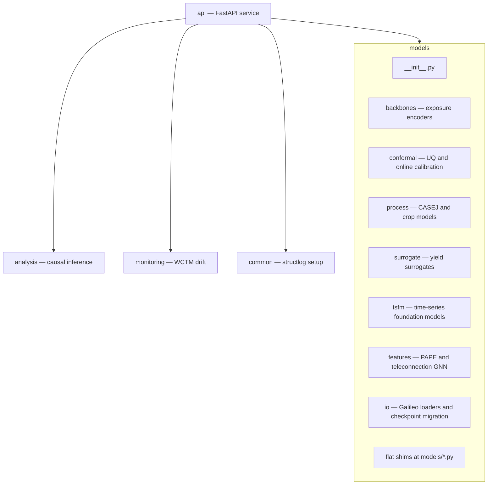

# Architecture — resilient-cocoa-model

## Package layout

Source code lives under `src/` with PEP 561 typing (`src/py.typed`). The **`models`** package is split into subpackages; flat imports such as `from models.yield_surrogate import YieldSurrogateModel` remain supported via thin shims.



| Subpackage | Role | Example import |
|------------|------|----------------|
| `models.backbones` | Segmentation / foundation encoders (Galileo, AgriFM, TerraMind, AEF) | `from models.galileo_seg import …` (shim) |
| `models.conformal` | CQR, ACI, ECI, conformal PID, online conformal | `from models.cqr import ConformalCalibrator` |
| `models.process` | CASEJ surrogate and ALMANAC/CASE2 runners | `from models.casej_surrogate import CASEJSurrogate` |
| `models.surrogate` | Yield surrogates v1/v2 and joint heads | `from models.yield_surrogate import YieldSurrogateModel` |
| `models.tsfm` | Time-series foundation model wrappers and ensemble | `from models.tsfm import TsfmEnsemble, HybridYieldSurrogate` |
| `models.features` | PAPE and teleconnection GNN | `from models.pape import PhenologyAwarePositionalEncoding` |
| `models.io` | Galileo feature extraction and checkpoint migration | `from models.checkpoint_migration import …` |

**Convention:** new code may use canonical paths (`models.surrogate.yield_surrogate`). Shims are for backward compatibility only.

## Logging

Structured logs use [structlog](https://www.structlog.org/) via `common.logging`:

```python
from common.logging import configure_logging
import structlog

configure_logging(level="INFO", json=True)
log = structlog.get_logger(__name__)
log.info("model_loaded", path=str(checkpoint_path))
```

Environment variables (API startup):

| Variable | Default | Meaning |
|----------|---------|---------|
| `LOG_LEVEL` | `INFO` | Python log level |
| `LOG_JSON` | `true` | JSON vs console rendering |

Every event includes `service=cocoa-model`, `version=<package version>`, and optional `trace_id` from `common.logging.trace_id_var`.

CI runs `python scripts/check_no_prints.py` to forbid bare `print()` under `src/`.

## Static typing

```bash
pip install -e ".[dev]"
pre-commit install
make typecheck-strict   # mypy --strict on strict_enabled modules (ratchet gate)
make typecheck          # mypy src/ with gradual per-module overrides
```

Configuration: `[tool.mypy]` and `[tool.cocoa.typing]` in `pyproject.toml`. Sprint 1 strict-enabled modules: `api.config`, `api.schemas`, `analysis._report`, `models.conformal.cqr`. Remaining packages use ranked `gradual_modules` with `disable_error_code` until promoted. See [`docs/TYPING_PLAYBOOK.md`](TYPING_PLAYBOOK.md).

## Docstrings

Public functions and classes in `models/`, `analysis/`, `monitoring/`, and `api/` use **NumPy-style** docstrings: Parameters, Returns, Raises, Notes (citations), Examples where helpful.

## License boundary

MIT application code must not import GPLv3 ATTRICI directly; ATTRICI runs in subprocesses only. See `.github/workflows/license-boundary.yml`.
