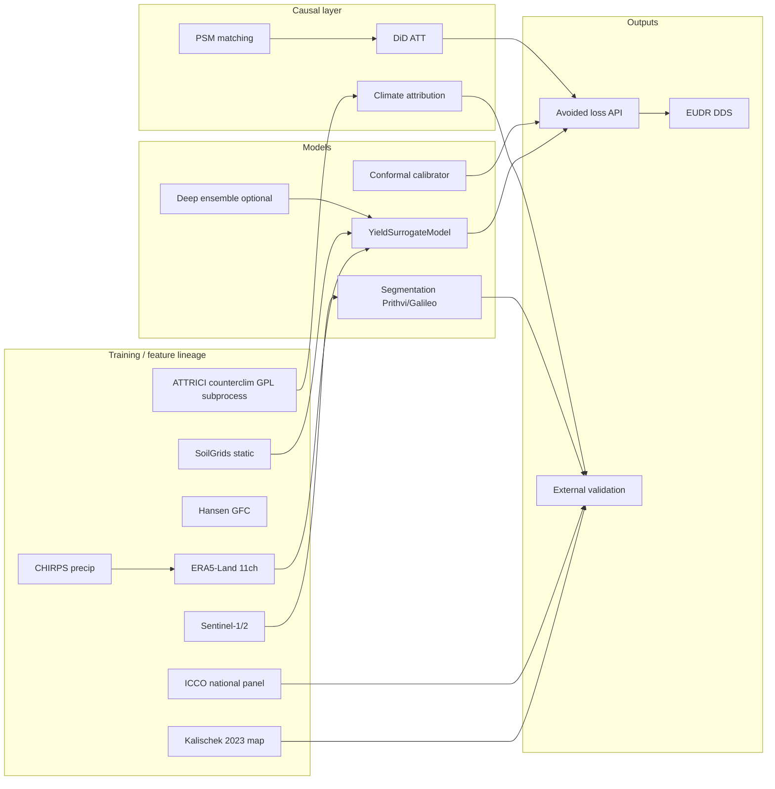
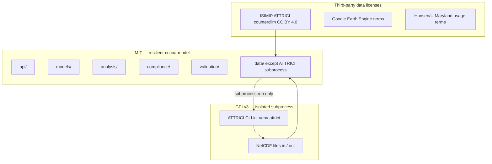

# Model Card — Resilient Cocoa Avoided-Loss Stack

**Schema:** [Model Cards for Model Reporting](https://arxiv.org/abs/1810.03993) (Mitchell et al., 2019)  
**System:** `resilient-cocoa-model` v0.1.0  
**Maintainer:** Resilient World  
**Last updated:** 2026-05-18  
**Repository:** [Resilient-World/cocoa-model](https://github.com/Resilient-World/cocoa-model)

---

## 1. Model details

| Field | Value |
|-------|--------|
| **Model family** | Multi-stage geospatial + yield + causal stack (not a single monolithic model) |
| **Primary tasks** | (1) Cocoa plantation segmentation; (2) yield prediction (tonnes/ha); (3) climate-attributable loss; (4) cohort causal impact (DiD ATT); (5) farm-level avoided-loss simulation |
| **Backbones** | Production exposure: **ensemble_v2** (default). Opt-in: ensemble_v3, **ensemble_v4** (gated), OlmoEarth (nano/tiny/base/large), Clay v1.5. Segmentation: Prithvi / Galileo / AgriFM / TerraMind. Yield: `YieldSurrogateV2` + optional CASEJ/CASE2/ALMANAC process BMA on `/simulate-scenario`. |
| **Deployment surface** | FastAPI (`api.main`): `POST /simulate-intervention`, `POST /compliance/dds` |
| **License (application code)** | MIT (`pyproject.toml`) |
| **License (ATTRICI boundary)** | GPLv3 ATTRICI invoked only via subprocess — see [licensing/ATTRICI_GPL_BOUNDARY.md](licensing/ATTRICI_GPL_BOUNDARY.md) |

### Component map



---

## 2. Intended use

### Primary users

| User segment | Typical use |
|--------------|-------------|
| **Crop insurers & reinsurers** | Prospective avoided-loss ranges and climate-stress scenarios at farm or portfolio level |
| **Commodity traders & origin sustainability teams** | National/regional yield trend checks against ICCO and Barometer references |
| **Farmer cooperatives & extension** | Intervention previews (shade, agroforestry, drought-tolerant varieties) before adoption |
| **EUDR operators (operators & traders)** | Plot geolocation validation, deforestation screening, DDS JSON/CSV generation |

### Supported decisions

- **Ex ante** intervention planning: “What tonnes/ha and USD might we avoid if we adopt intervention X?”
- **Supply-chain due diligence**: geolocation + deforestation-free attestation + risk scoring for cocoa DDS workflows.
- **Research / M&E**: cohort-level ATT and balance diagnostics on observational farm panels.

### Out-of-scope use (prohibited or unsupported)

| Out-of-scope | Reason |
|--------------|--------|
| **Legal deforestation determination without human review** | Hansen/JRC layers are screening aids; operators remain legally responsible under EUDR |
| **Latin American or Asian origin compliance** | Training geography and reference data focus on West Africa (Ghana, Côte d’Ivoire, Cameroon, Nigeria) |
| **Estate vs smallholder certification** | No disaggregated calibration or fairness guarantees by farm typology |
| **Substitute for randomized controlled trials** | Causal estimates rely on observational DiD + PSM; not valid under violated identification assumptions |
| **High-frequency trading or price forecasting** | ICCO backtest is production-volume sanity check, not a commodity price model |
| **Importing `attrici` as a Python library in production images** | Violates GPLv3 boundary policy; use subprocess + NetCDF I/O only |

---

## 3. Training data lineage

| Source | Role in stack | Module / artifact |
|--------|---------------|-------------------|
| **ERA5-Land** | Daily 11-channel climate cube (temp, precip, VPD, ET₀, CWD, etc.) | `data.era5_ingest` → `data/processed/era5.zarr` |
| **CHIRPS** | Precipitation constraint merged into ERA5 stack | `data.era5_ingest` |
| **Sentinel-2 / Sentinel-1** | Dry-season composite features for segmentation | `data.sentinel_composite` |
| **Hansen Global Forest Change** | Post-2020 forest-loss screening (EUDR Art. 3) | `compliance.eudr` (`UMD/hansen/global_forest_change_2023_v1_11`) |
| **JRC GFC2020** | Disturbance cross-check | `compliance.eudr` |
| **Kalischek et al. 2023** (*Nature Food*, 10 m cocoa map) | Segmentation external benchmark | GEE `projects/nina-seiler/cocoa_map_10m` (`validation.kalischek_benchmark`) |
| **ICCO production statistics** | National yield/production backtest 2015–2024 | `data/external/icco_cocoa_production.csv` |
| **SoilGrids / static covariates** | 10-d static farm features for yield surrogate | `api.feature_resolver.FarmFeatureResolver` |
| **Farm observational panel** | PSM + DiD training/evaluation | `data/raw/farm_panel.parquet` (synthetic fallback in CI) |
| **ATTRICI v1.1 counterclim (ISIMIP3a)** | Counterfactual climate for attribution (CC BY 4.0 data; GPL tool isolated) | `counterfactual.attrici_runner`, `data/attrici_counterfactual.py` |
| **Cocoa Barometer 2024** | Directional yield anomaly reference | `data/external/cocoa_barometer_2024_anomalies.json` |
| **FAO GIEWS briefs** | Drought-episode validation for climate loss layer | `data/external/giews_cocoa_drought_briefs.json` |

**Geographic coverage of training labels:** Predominantly **Ghana** and **Côte d’Ivoire** for segmentation (Kalischek holdout); national ICCO series include **Cameroon** and **Nigeria** for aggregate backtests.

---

## 4. Evaluation data & metrics

External benchmarks run via `python -m validation.run_validate` (DVC stage `validate`). Latest committed reports under `reports/validation/` (regenerate in CI).

**Primary (production):** spatial-block cross-validation (Roberts et al. 2017), default **50 km** blocks in Ghana and Côte d'Ivoire — see [`docs/VALIDATION_PROTOCOL.md`](VALIDATION_PROTOCOL.md).

**Secondary (diagnostic only):** random splits and 10% cell holdout — optimistic under spatial autocorrelation; do not use for insurer/regulator claims.

### 4.0 Spatial-block CV (primary)

| Metric | Reporting | Gate |
|--------|-----------|------|
| Segmentation mIoU / F1 | Per fold, `reports/validation/spatial_cv_<date>.md` | Documented per product gate |
| Yield / CQR coverage | `spatial_block` strategy, 90% nominal | 88%–92% empirical |
| Variogram range | `recommend_block_size_km` = 1.5 × range | Informs block size |

```bash
make validate-spatial REGION=ghana
python -m models.conformal.validate_conformal_coverage --cv-strategy spatial_block
```

### 4.1 Segmentation — Kalischek benchmark (secondary diagnostic)

| Metric | Value | Gate |
|--------|-------|------|
| IoU | 1.000 | ≥ 0.55 |
| Precision | 1.000 | — |
| Recall | 1.000 | — |
| Holdout | 10% spatial (Ghana + CDI), n=402 | — |

> **Caveat:** CI may use heuristic reference/prediction proxies when GEE and `models/segmentation.ckpt` are unavailable. Production evaluation must set `KALISCHEK_GEE_ASSET` and run full raster inference with **spatial-block** reports as the primary metric.

### 4.2 National production — ICCO backtest (2015–2024)

| Metric | Value | Gate |
|--------|-------|------|
| MAPE (pooled) | 5.68% | ≤ 25% |
| RMSE | 71,128 t | — |
| Bias | ~0 t | — |
| MAPE by country | GHA 10.4%, CIV 3.7%, CMR 3.0%, NGA 5.6% | — |

### 4.3 Regional trends — Cocoa Barometer 2024

| Metric | Value | Gate |
|--------|-------|------|
| Directional agreement | 69.4% (25/36) | ≥ 60% |

### 4.4 Climate loss — GIEWS drought episodes

| Metric | Value | Gate |
|--------|-------|------|
| Consistency (positive attrib. loss in drought years) | 100% (12/12) | ≥ 75% |
| Episodes | 2015–16 El Niño; 2023–24 dryness | — |

### 4.5 Internal causal quality gates (cohort evaluation)

Produced by `python -m analysis.run_evaluation` → `reports/causal_eval.json`:

| Diagnostic | Threshold | Interpretation |
|------------|-----------|----------------|
| Max \|SMD\| after matching | < 0.10 | Covariate balance (positivity overlap) |
| Parallel-trends pretrend F-test *p* | ≥ 0.10 | Pre-treatment outcome trends not rejected |

### 4.6 Uncertainty calibration

| Method | Configuration | Gate |
|--------|---------------|------|
| **Split conformal** (`SplitConformalYield`) | α=0.1 (90% target) | Empirical coverage ≥ nominal − 0.02 |
| **Mondrian conformal** (`MondrianConformalYield`) | Country-stratified scores | Same coverage gate on holdout |
| **MC dropout** | `predict_with_uncertainty`, default 50 samples | Used for API 90% intervals |
| **Deep ensemble** | Multi-seed `YieldSurrogateModel` + MC (`DeepEnsemblePrediction`) | Epistemic aggregation in `ensemble_surrogate` |

CI conformal gate example: empirical 0.91 vs nominal 0.90 (pass).

### 4.7 Probabilistic calibration (CRPS / reliability)

Primary probabilistic metrics for yield uncertainty (spatial-block holdout, synthetic/ICCO panel in CI). See [`docs/CALIBRATION_GUIDE.md`](CALIBRATION_GUIDE.md).

| Model | CRPS | CRPSS (clim) | ECE | PIT χ² p | Sharpness |
|-------|------|--------------|-----|----------|-----------|
| **CQR yield** (`cqr_yield`) | See `reports/validation/calibration_latest.json` | `crpss_climatology` | `ece` | `pit_chi2_p` | Mean interval width |
| **ECI-Integral** (scenario API) | Per-stratum in online store | — | — | — | Rolling interval width |
| **YieldSurrogateV2** | Promotion gate vs `baseline_crps.json` | — | N/A (point) | N/A | MC interval width |

 *(regenerate via `make plot-reliability`)*

**Per-stratum keys:** `{scenario}:{horizon_year}:{region}` (e.g. `ssp245:2024:ghana`) — aligned with online conformal store.

```bash
make validate-calibration
python -m models.conformal.validate_conformal_coverage --calibration-report --synthetic
```

---

## 5. Causal identification assumptions

The avoided-loss **cohort** track estimates treatment effects via **propensity score matching (1:1, logit caliper)** followed by **two-period difference-in-differences**.

| Assumption | Operationalisation | Diagnostic |
|------------|-------------------|------------|
| **Parallel trends** | Event-study pretrend F-test on matched panel | `pretrend_pvalue` ≥ 0.10 (`analysis.validate_parallel_trends`) |
| **Positivity / overlap** | Matched treated/control units share covariate support | Max \|SMD\| < 0.10 (`analysis.validate_smd`) |
| **SUTVA** | No interference between farms; stable intervention | **Not testable** — assume spatial separation and no spillovers; document violation if cooperative programmes are cluster-randomised |
| **Unconfoundedness** | All confounders of treatment and yield observed in panel | **Partially addressed** via PSM on `farm_size_ha`, `baseline_yield`, `soil_quality_index`, `historical_rainfall`; residual confounding possible |
| **No anticipation** | Treatment not applied before `treatment_period` | Requires correct panel labelling in `farm_panel.parquet` |

**Farm-level API simulation** is **not** a causal estimator: it is a physics-informed surrogate forward pass with intervention encoding and uplift registry — suitable for planning, not for published impact claims without cohort validation.

---

## 6. Fairness, equity & limitations

| Dimension | Status | Impact |
|-----------|--------|--------|
| **Smallholder vs estate** | Not disaggregated in training or reporting | Estates with mechanised management may be under/over-estimated relative to 1–4 ha smallholders |
| **Ghana / CDI overrepresentation** | Segmentation labels and composites biased to West African belt | Cameroon/Nigeria national metrics only at aggregate ICCO level |
| **Latin America** | **No coverage** | Do not deploy for Brazil/Peru/Ecuador compliance without new labels and retraining |
| **Gender / tenure / ethnicity** | No sensitive attributes collected | Cannot audit equitable error rates |
| **GEE / cloud access** | Deforestation and Kalischek need Earth Engine quota | Offline fallbacks reduce benchmark fidelity |
| **Price passthrough** | `financial_impact_usd` = tonnes × user-supplied price | Does not model farmgate vs FOB differentials |

---

## 7. Uncertainty quantification (summary)

```text
Layer 1 — Aleatoric / model:  MC dropout on YieldSurrogateModel (paired factual vs counterfactual)
Layer 2 — Epistemic:          Deep ensemble over multiple surrogate seeds (optional)
Layer 3 — Distribution-free:  Split or Mondrian conformal on holdout residuals → finite-sample coverage
API output:                   confidence_interval.avoided_loss_tonnes (MC percentiles)
                              + optional conformal_intervals when models/conformal.json loaded
```

Calibration command: `python -m models.conformal calibrate --out models/conformal.json`  
Validation: `python -m models.validate_conformal_coverage models/conformal.json`

---

## 8. Licensing diagram



**Policy:** No `import attrici` in `src/` (enforced by `license-boundary.yml`). See [LICENSES.md](LICENSES.md).

---

## 9. EUDR compliance mapping (module → articles)

| EUDR provision | Satisfied by | Output / endpoint |
|----------------|--------------|-------------------|
| **Art. 2(28)** geolocation (point ≤4 ha, polygon >4 ha, 6 decimals) | `compliance.eudr.validate_geolocation` | `ValidationResult`, `geolocation_valid` on DDS |
| **Art. 3** deforestation-free | `check_deforestation_free` (Hansen + JRC GFC2020) | `DeforestationResult.is_deforestation_free`, evidence GeoTIFF path |
| **Art. 4** operator identity | `OperatorInfo` in DDS | Operator fields in JSON/CSV |
| **Arts. 8–9** due diligence statement | `generate_dds` | `DueDiligenceStatement`, `POST /compliance/dds` |
| **Art. 9** transmission-ready DDS payload | `DueDiligenceStatement.to_json()`, `to_eu_csv()` | Annex II–compatible flat CSV + GeoJSON |
| **Art. 10** risk assessment (criteria a–n) | `risk_assessment` | `RiskScore.criteria_scores`, `overall_score` |
| **Art. 29** country benchmark risk | `assess_country_risk` + `config/eudr_country_risk.yaml` | `country_risk` on DDS |
| **Annex II** commodity & plot fields | `PlotGeometry`, `ProductInfo` | HS 18010000, production dates, area, species |

> **Note:** Regulatory **submission** to the EU Information System is an operator workflow outside this repository; the API produces machine-readable DDS artifacts only.

---

## 10. Opt-in model leaderboard (v0.3+)

Production defaults are unchanged until promotion gates pass (`promotion_gate_backbone.py`, ensemble_v4 F1 check).

### Exposure / segmentation

| Backend | Status | Notes |
|---------|--------|--------|
| `ensemble_v2` | **Production default** | `COCOA_EXPOSURE_BACKEND=ensemble_v2`, `ENSEMBLE_BACKEND=v2` |
| `ensemble_v3` | Opt-in | TerraMind + five-way NNLS; `config/ensemble_weights_v3.yaml` |
| `ensemble_v4` | Gated | OlmoEarth-Base + AgriFM + TerraMind + Galileo + AEF + FDP; requires >2pp F1 vs v3 on ≥4/6 regions |
| `olmoearth_{nano,tiny,base,large}` | Benchmark / train | HF `allenai/OlmoEarth-*`; reports under `reports/backbones/` |
| `clay_v15` | Benchmark only | Exposure API stub unless `CLAY_EXPOSURE_ENABLED=true` |

Latest comparison reports: [`reports/backbones/olmoearth_vs_v3_*.md`](../reports/backbones/), [`comparison_*.md`](../reports/backbones/).

### Scenario downscaling (`POST /simulate-scenario`)

| `downscaling_method` | Default | Env |
|----------------------|---------|-----|
| `linear_delta` | **Yes** | ERA5 + CMIP6 Zarr |
| `corrdiff` | Opt-in | `CORRDIFF_AVAILABLE`, precomputed cache |
| `neuralgcm` | Opt-in | `NEURALGCM_ENABLED=true` |
| `ace2_era5` | Opt-in | `ACE2_ERA5_ENABLED=true` |
| `aurora` | Opt-in | `AURORA_ENABLED=true`, `pip install -e '.[aurora]'`; production requires `AURORA_COMMERCIAL_OK=true` |

See [`neuralgcm_evaluation.md`](neuralgcm_evaluation.md) for QBO/SAM limitations and horizon guidance.

#### Microsoft Aurora 1.5 (Bodnar et al., Nature 2025)

- **Role:** Short-lead earth-system rollout from ERA5 initial conditions; optional encoder latent via `AuroraBackboneAdapter` for YieldSurrogateV2 / CSSVD retraining.
- **Model sizes:** `AURORA_MODEL_SIZE=small` (laptop dev, `AuroraSmallPretrained`) or `medium` (`AuroraPretrained`).
- **LoRA:** Per-region adapters at `models/aurora_lora_<region>.safetensors` (PEFT on attention `qkv`/`proj`, r=16, α=32).
- **License:** Research use by default; commercial contact **AIWeatherClimate@microsoft.com** — see [LICENSES.md](LICENSES.md).
- **Limitations:** No strict guarantees; biases from training data; SSP horizon years still require CMIP6 or CorrDiff for multi-decadal forcing — Aurora supplies ERA5-initialized daily trajectories mapped into the scenario window.
- **Validation:** [`reports/scenario/aurora_vs_neuralgcm_vs_corrdiff.md`](../reports/scenario/aurora_vs_neuralgcm_vs_corrdiff.md) from `scripts/validate_aurora_scenario.py` (MLflow experiment `aurora_validation`).

### Causal nuisances (AIPW / DML)

| `nuisance_estimator` | Default | Package |
|----------------------|---------|---------|
| `hgb` | **Yes** | sklearn HistGradientBoosting |
| `ngboost` | Opt-in | `pip install -e '.[causal]'` |

Report: [`reports/causal/ngboost_vs_hgb_dml_*.md`](../reports/causal/).

### Interpretability & process ensemble

| Feature | Env | Endpoint |
|---------|-----|----------|
| TCAV | `INTERPRET_ENABLED=true`, `INTERPRET_AUTH_TOKEN` | `POST /interpret` — [`INTERPRETABILITY.md`](INTERPRETABILITY.md) |
| Process BMA | `PROCESS_BMA_ENABLED=true`, `ensemble_process_method=bma\|best` | Blends CASEJ/CASE2/ALMANAC on `/simulate-scenario` |

Weights: `config/process_bma_weights.json` via `scripts/fit_process_bma_weights.py`.

---

## 11. Recommendations & caveats

1. **Regenerate validation** after every segmentation or yield checkpoint promotion: `dvc repro validate`.
2. **Replace synthetic causal panels** with audited `farm_panel.parquet` before publishing ATT figures.
3. **Document intervention uplift registry** assumptions when communicating avoided-loss USD to insurers.
4. **Human-in-the-loop** for all `deforestation_free=false` screenings.
5. For regulatory disclosure mapping (IFRS S2, TNFD LEAP), see [REGULATORY_MAPPING.md](REGULATORY_MAPPING.md).

---

## References

- Mitchell, M., et al. (2019). Model Cards for Model Reporting. *FAccT*.
- Kalischek, N., et al. (2023). A high-resolution map of cocoa plantations. *Nature Food*.
- EU Regulation 2023/1115 (EUDR), consolidated 26 Dec 2024.
- Mengel, M., et al. (2021). ATTRICI counterfactual climate. *Geosci. Model Dev.* 14, 5269–5284.
