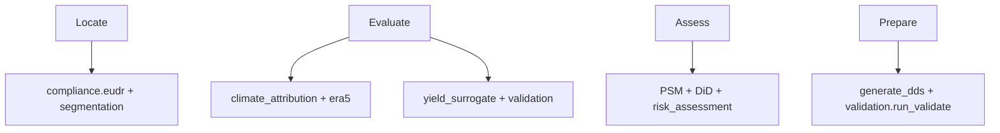

# Regulatory & disclosure mapping — quantitative outputs

This document maps **every quantitative output** of the Resilient Cocoa avoided-loss stack to:

- **EU Deforestation Regulation (EU) 2023/1115** — Art. 9 (due diligence statement / transmission), Art. 10 (risk assessment), Annex II (DDS field set)
- **IFRS S2** — *Climate-related Disclosures* (ISSB, 2023)
- **TNFD** — *LEAP* nature-related risk assessment (Locate → Evaluate → Assess → Prepare)

For model context, limitations, and causal assumptions, see [MODEL_CARD.md](MODEL_CARD.md).

**Disclaimer:** This mapping is an engineering aid for compliance and sustainability teams. It is **not legal advice**. Operators remain responsible for conformity assessments and statutory filings.

---

## 1. Output inventory

| ID | Quantitative output | Units | Primary module | Typical consumer |
|----|---------------------|-------|----------------|------------------|
| O1 | Plot centroid / polygon coordinates | ° dec, 6+ dp | `compliance.eudr.validate_geolocation` | EUDR DDS |
| O2 | Plot area | ha | `PlotGeometry.area_ha` | EUDR DDS |
| O3 | Hansen forest-loss pixels / area | count, ha | `check_deforestation_free` | Art. 3 attestation |
| O4 | JRC GFC2020 disturbance flag | boolean | `check_deforestation_free` | Art. 3 evidence |
| O5 | `deforestation_free` | boolean | `DeforestationResult` | DDS |
| O6 | Art. 10 criterion scores (a–n) | 0–1 | `risk_assessment` | DDS risk annex |
| O7 | `overall_score` / `risk_level` | 0–1, enum | `RiskScore` | DDS |
| O8 | Country benchmark risk | low / standard / high | `assess_country_risk` | Art. 29 |
| O9 | Segmentation IoU / precision / recall | 0–1 | `validation.kalischek_benchmark` | MRV / model risk |
| O10 | National production MAPE / RMSE / bias | %, t | `validation.icco_yield_backtest` | Trader / insurer |
| O11 | Regional trend directional agreement | % | `validation.cocoa_barometer_check` | Sustainability reporting |
| O12 | Climate-attributable loss consistency | % | `validation.giews_drought_validation` | Climate risk |
| O13 | DiD ATT | t/ha | `analysis.did_impact` | Impact claims |
| O14 | DiD standard error | t/ha | `analysis.did_impact` | Uncertainty |
| O15 | Max \|SMD\| (matched) | — | `analysis.psm_matching` | Causal defensibility |
| O16 | Parallel-trends pretrend *p*-value | — | `analysis.event_study` | Causal defensibility |
| O17 | Avoided revenue loss (cohort) | USD | `analysis.did_impact.calculate_avoided_revenue_loss` | IFRS S2 metrics |
| O18 | `baseline_yield_tonnes_per_ha` | t/ha | `api.simulation` | Product / IFRS |
| O19 | `projected_yield_tonnes_per_ha` | t/ha | `api.simulation` | Product / IFRS |
| O20 | `avoided_loss_tonnes` | t | `api.simulation` | Product / IFRS |
| O21 | `financial_impact_usd` | USD | `api.simulation` | IFRS S2 |
| O22 | MC 90% CI on avoided loss | t | `confidence_interval` | Risk disclosure |
| O23 | Conformal interval (yield / avoided loss) | t/ha or t | `models.conformal` | Risk disclosure |
| O24 | `empirical_coverage` / `nominal_coverage` | 0–1 | `models/conformal.json` | Model risk control |
| O25 | Climate-attributable loss (grid/farm) | t/ha or index | `analysis.climate_attribution` | TNFD Evaluate |
| O26 | Net mass on DDS | kg | `ProductInfo.net_mass_kg` | Annex II |

---

## 2. EUDR (EU) 2023/1115

### 2.1 Art. 9 — Due diligence statement (submission payload)

Art. 9 requires operators to **submit** a due diligence statement before placing relevant commodities on the EU market. The stack produces the **quantitative and geospatial fields** required in that statement (Annex II alignment).

| Output ID | Field / metric | Annex II / DDS element | API / artifact |
|-----------|----------------|------------------------|----------------|
| O1 | Geolocation GeoJSON | Production plot location | `DueDiligenceStatement.geolocation_geojson`, `POST /compliance/dds` |
| O2 | Area (ha) | Plot size | `PlotGeometry.area_ha`, CSV `AreaHa` |
| O26 | Net mass (kg) | Quantity placed on market | `ProductInfo.net_mass_kg`, CSV `NetMassKg` |
| O5 | Deforestation-free flag | Legality / deforestation leg | CSV `DeforestationFree` |
| O8 | Country risk class | Risk leg (with Art. 29) | CSV `CountryRisk` |
| O7 | Overall risk score | Supporting risk narrative | CSV `OverallRiskScore` |
| — | Reference number, dates, operator | Administrative | `reference_number`, `statement_date`, `OperatorInfo` |

**Artifacts:** `dds.to_json()`, `dds.to_eu_csv()` from `generate_dds` / `POST /compliance/dds`.

> Geolocation **rules** (point vs polygon, decimal precision) are defined in **Art. 2(28)** and enforced by `validate_geolocation` before DDS generation.

### 2.2 Art. 10 — Risk assessment

Art. 10 requires a risk assessment covering criteria **(a)–(n)** before concluding negligible risk.

| Output ID | Role in Art. 10 | Implementation |
|-----------|-----------------|----------------|
| O6 | Normalised scores per criterion a–n | `risk_assessment` → `RiskScore.criteria_scores` |
| O7 | Aggregated risk | `overall_score`, `risk_level` |
| O3, O4, O5 | Deforestation / forest-risk leg (criterion **a**) | Hansen/JRC → `forest_risk` in scoring |
| O8 | Country and benchmark risk (criterion **k** and context) | `assess_country_risk`, weights in `_COUNTRY_RISK_WEIGHT` |
| — | Supply-chain complexity (h, i, j) | Request field `supply_chain_complexity` on `POST /compliance/dds` |

**Non-quantitative:** Documented mitigation measures and supplier engagement remain operator responsibilities outside the model.

### 2.3 Annex II — DDS field mapping

| Annex II theme | Quantitative outputs | Source |
|----------------|---------------------|--------|
| Commodity description | HS code 18010000, species, description | `ProductInfo` |
| Producer / plot ID | `producer_id`, `plot_id` | `PlotGeometry` |
| Production period | `production_start`, `production_end` | `PlotGeometry` |
| Geolocation | O1, O2 | `validate_geolocation` + plot polygon |
| Deforestation status | O5, O3 | `DeforestationResult` |
| Risk | O6, O7, O8 | `RiskScore`, country risk |

---

## 3. IFRS S2 — climate-related disclosures

IFRS S2 requires entities to disclose **governance, strategy, risk management, and metrics & targets** for climate-related risks and opportunities. The table below maps **metrics** producible by this stack to typical disclosure paragraphs (entity-specific materiality applies).

| IFRS S2 area | Paragraph theme | Output IDs | How to use |
|--------------|-----------------|------------|------------|
| **Metrics & targets** | Climate-related physical risk (yield sensitivity) | O18–O20, O25, O12 | Scenario yields and climate-attributable loss for cocoa exposure |
| **Metrics & targets** | Transition / adaptation (intervention benefit) | O20–O22, O23 | Avoided loss tonnes and CIs from `POST /simulate-intervention` |
| **Metrics & targets** | Financial effects | O17, O21 | USD impacts; link to revenue lines in sustainability report |
| **Risk management** | Model risk & validation | O9–O11, O24 | External validation gates; document in controls narrative |
| **Risk management** | Causal evidence for impact programmes | O13–O16 | ATT + balance/trend diagnostics for M&E annex |
| **Strategy** | Resilience investments | O19 vs O18 delta | Intervention types in API enum |
| **Governance** | *(qualitative)* | — | Board oversight not generated by model |

### Suggested disclosure table (example row)

| Metric | 2024 value | Source output | Boundary |
|--------|------------|---------------|----------|
| Modeled avoided yield loss (shade intervention scenario) | O20 t | API simulation | Single farm; not portfolio |
| 90% uncertainty range | O22 | MC conformal | Same boundary |
| Climate drought loss signal consistency | O12 = 100% | GIEWS validation | West Africa cocoa belt |

---

## 4. TNFD — LEAP approach

| LEAP phase | TNFD question | Output IDs | Stack capability |
|------------|---------------|------------|------------------|
| **L — Locate** | Where is the interface with nature? | O1, O2, O9 (mapped extent) | Plot geolocation; segmentation vs Kalischek |
| **E — Evaluate** | What are dependencies & impacts? | O18–O20, O25, O12 | Yield under climate stress; GIEWS-consistent loss |
| **A — Assess** | Material risks & opportunities? | O6–O8, O13–O16, O10 | EUDR risk scores; causal ATT; national MAPE |
| **P — Prepare** | What to report & target? | O5, O7, DDS CSV/JSON | DDS artifacts; validation summary for TNFD metrics annex |

### LEAP → module crosswalk



---

## 5. Master mapping matrix

| Output | EUDR Art. 9 / Annex II | EUDR Art. 10 | IFRS S2 | TNFD LEAP |
|--------|------------------------|--------------|---------|-----------|
| O1 Geolocation | ✓ Annex II | Supports traceability risk | — | **L** |
| O2 Area | ✓ Annex II | Plot size risk (g) | — | **L** |
| O3–O5 Deforestation metrics | ✓ legality | Criterion **a** | Physical risk | **E**, **P** |
| O6–O7 Risk scores | ✓ supporting | ✓ core | Risk management | **A**, **P** |
| O8 Country risk | ✓ | ✓ criterion **k** | Geopolitical/climate | **A** |
| O9 Segmentation metrics | MRV evidence | Model risk | Model risk | **L** |
| O10 ICCO MAPE/RMSE | — | — | Metrics (volume) | **E**, **A** |
| O11 Barometer agreement | — | — | Strategy narrative | **E** |
| O12 GIEWS consistency | — | — | Physical risk | **E** |
| O13–O14 ATT / SE | — | Programme evidence | Metrics & targets | **A** |
| O15–O16 SMD / pretrend *p* | — | — | Methodology annex | **A** |
| O17 Cohort USD loss | — | — | ✓ financial | **A** |
| O18–O21 Farm simulation | — | Planning only | ✓ scenarios | **E**, **A** |
| O22–O24 Uncertainty | — | — | ✓ risk ranges | **E**, **A** |
| O25 Climate attrib. loss | — | — | ✓ physical | **E** |
| O26 Net mass | ✓ Annex II | — | Revenue linkage | **P** |

---

## 6. Gaps & operator actions

| Gap | Regulation / framework | Recommended action |
|-----|------------------------|-------------------|
| No automated EU IS upload | EUDR Art. 9 | Use `dds_csv` as import template; submit via national competent system |
| Synthetic causal panel in CI | IFRS S2 / TNFD **A** | Ship audited `farm_panel.parquet` for production disclosures |
| Latin America absent | EUDR / TNFD **L** | Do not claim global coverage |
| Price assumptions user-supplied | IFRS S2 financial | Disclose farmgate vs market price basis |
| Biodiversity beyond forest loss | TNFD | Complement with separate biodiversity datasets |

---

## 7. Regeneration commands

```bash
# External validation reports (O9–O12)
PYTHONPATH=src python -m validation.run_validate --reports-dir reports/validation

# Causal diagnostics (O13–O16)
PYTHONPATH=src python -m analysis.run_evaluation --out reports/causal_eval.json

# EUDR DDS example (O1–O8, O26)
curl -X POST http://localhost:8000/compliance/dds -H "Content-Type: application/json" -d @fixtures/dds_request.json

# Farm scenario (O18–O23)
curl -X POST http://localhost:8000/simulate-intervention -H "Content-Type: application/json" -d @fixtures/simulate_request.json

# SSP horizon scenario with optional Aurora downscaling (research license; commercial gate)
# AURORA_ENABLED=true AURORA_MOCK=1 curl -X POST http://localhost:8000/simulate-scenario \
#   -H "Content-Type: application/json" -d '{"downscaling_method":"aurora", ...}'
```

**Aurora 1.5 (opt-in):** Maps to O18–O21 physical-risk scenario yields when `downscaling_method=aurora`. Document
research-only default license and `AURORA_COMMERCIAL_OK` for production in [LICENSES.md](LICENSES.md) and
[MODEL_CARD.md](MODEL_CARD.md). Online conformal strata use suffix `:aurora` (separate from `:corrdiff`).

---

## References

- IFRS S2 *Climate-related Disclosures* (ISSB, issued 2023).
- TNFD *Recommendations on Nature-related Financial Disclosures* (2023), LEAP guidance.
- Regulation (EU) 2023/1115 (EUDR), EUR-Lex 32023R1115.
