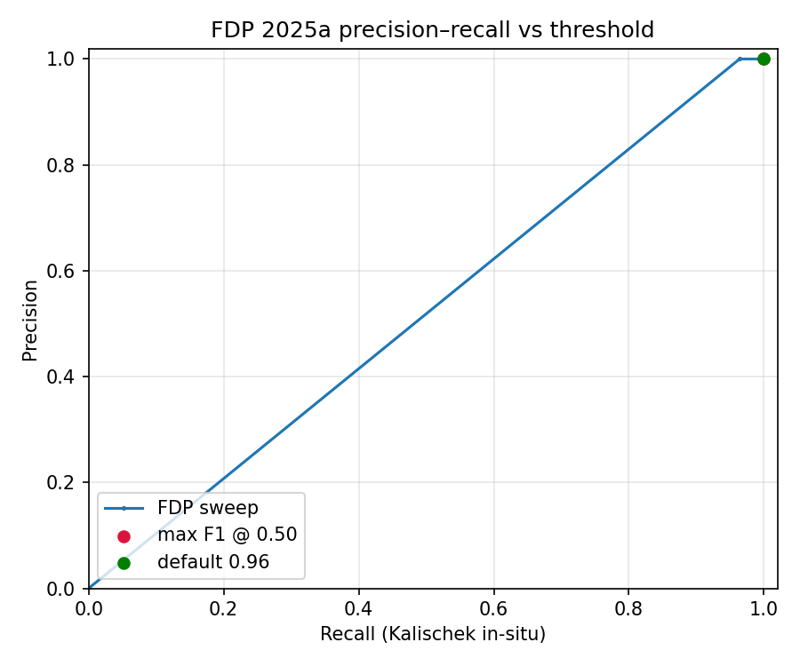

# FDP 2025a threshold calibration (2026-05-20)

Stratified **500** points over Côte d'Ivoire + Ghana vs Kalischek et al. (2023) in-situ reference (`projects/nina-seiler/cocoa_map_10m`).

- FDP collection: `projects/forestdatapartnership/assets/cocoa/model_2025a` (2023)
- Model card (F1-optimal ≈ **0.96**): https://github.com/google/forest-data-partnership/tree/main/models/cocoa
- Repo default threshold: **0.96**
- Data mode: **synthetic (mock)**

## Best thresholds

| Criterion | Threshold | Precision | Recall | F1 | Youden J |
|-----------|-----------|-----------|--------|-----|----------|
| Max F1 | 0.50 | 1.000 | 1.000 | 1.000 | 1.000 |
| Max Youden J | 0.50 | 1.000 | 1.000 | 1.000 | 1.000 |

## Sweep (selected thresholds)

| Threshold | Precision | Recall | F1 | Youden J |
|-----------|-----------|--------|-----|----------|
| 0.50 | 1.000 | 1.000 | 1.000 | 1.000 |
| 0.55 | 1.000 | 1.000 | 1.000 | 1.000 |
| 0.60 | 1.000 | 1.000 | 1.000 | 1.000 |
| 0.65 | 1.000 | 1.000 | 1.000 | 1.000 |
| 0.70 | 1.000 | 1.000 | 1.000 | 1.000 |
| 0.75 | 1.000 | 1.000 | 1.000 | 1.000 |
| 0.80 | 1.000 | 1.000 | 1.000 | 1.000 |
| 0.85 | 1.000 | 1.000 | 1.000 | 1.000 |
| 0.90 | 1.000 | 1.000 | 1.000 | 1.000 |
| 0.95 | 1.000 | 1.000 | 1.000 | 1.000 |
